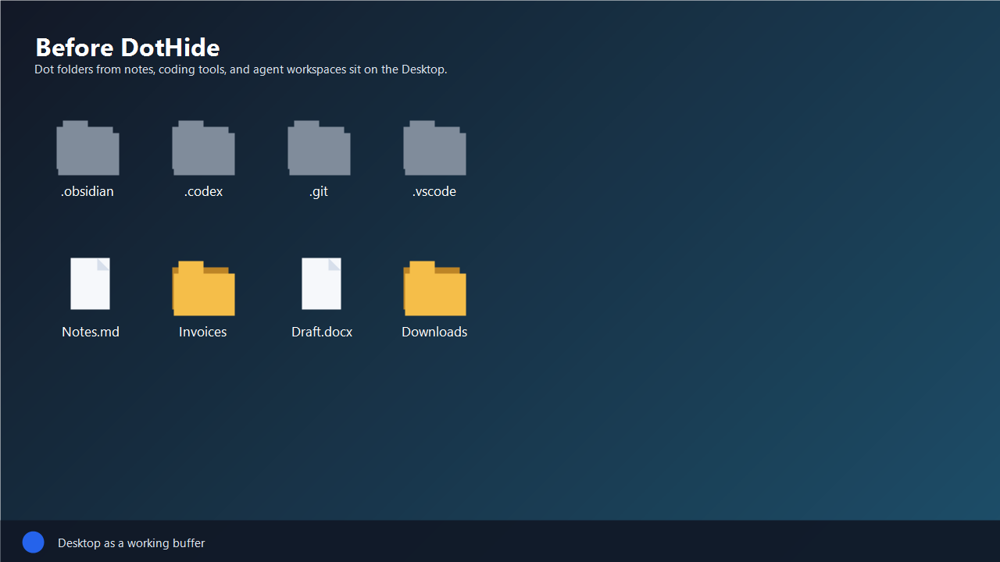
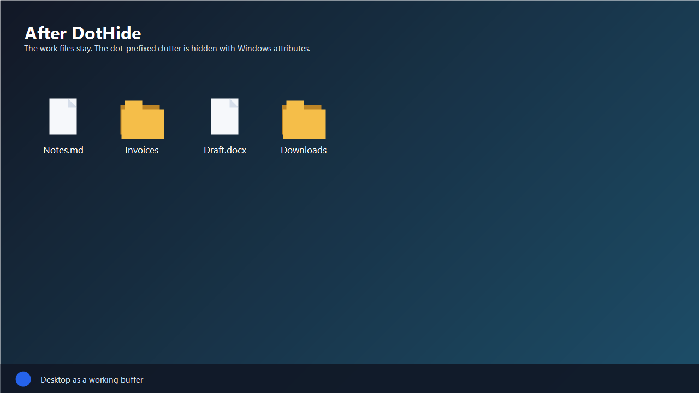

# DotHide

<p align="center">
  
</p>

DotHide is a tiny portable Windows app for hiding dot-prefixed files and folders such as `.obsidian`, `.codex`, `.claude`, and `.cursor`.

It is built for people who usually like seeing hidden files, but still want a calmer Desktop or workspace without an installer, a tray app, Explorer hooks, or a background service.

## Why

File Explorer's hidden-file setting is broad: when you show hidden items, you usually see all of them. That is useful when you need to inspect hidden files, but it can make the Desktop noisy when note apps or agentic tools create folders like `.obsidian` or `.codex`.

DotHide gives you a small control panel for hiding those dot-prefixed items in specific folders while leaving your normal Explorer preferences alone.

## Screenshots

<table>
  <tr>
    <td></td>
    <td></td>
  </tr>
  <tr>
    <td align="center"><strong>Before</strong></td>
    <td align="center"><strong>After</strong></td>
  </tr>
</table>

## Download

Get the latest portable Windows build from the [GitHub Releases page](https://github.com/LuBolin/DotHide/releases/latest).

## Features

- Hide or show dot-prefixed files and folders
- Manage one or more root folders, including Desktop
- Use a global default: hide all dot items or show all dot items
- Add per-folder configs when a specific folder should behave differently
- Add exception names that do the opposite of the current rule
- Use stronger hiding with Windows Hidden + System attributes
- Restore managed items back to their original attributes
- Portable config next to the executable
- No telemetry, no network access, no background process

## Desktop Notes

DotHide works especially well for Desktop clutter such as `.obsidian` and `.codex`.

Many people use Desktop as a working buffer: Word documents, PowerPoint decks, PDFs, downloads, screenshots, drafts, and other current work all land there. That is also where agentic tools often get pointed, because the files being edited are already on the Desktop.

That workflow is convenient, but it means helper folders created by those tools can end up in a very visible place.

Common examples:

- `.obsidian` when Desktop is used as an Obsidian vault
- `.codex`, `.claude`, `.cursor`, or similar folders from coding/agent tools
- other dot-prefixed tool folders that are useful to the tool but noisy to look at

Windows virtual desktops share the same Desktop folder and icon surface. DotHide changes file attributes on the actual Desktop items, so a hidden item is hidden across all virtual desktops for that Windows user.

If your Desktop is redirected through OneDrive, DotHide uses the redirected Desktop path that Windows reports.

## How It Works

DotHide only changes Windows file attributes. It does not delete, move, rename, encrypt, edit, or upload files.

Rules are intentionally simple:

1. Global config applies to all managed folders.
2. Global exceptions do the opposite of the global config.
3. Folder configs override the global config for a folder.
4. Folder exceptions do the opposite of that folder config.

Stronger hide sets both the Hidden and System attributes. This keeps items hidden in normal File Explorer use, even when hidden items are shown. To see those items manually, Windows must also show protected operating system files.

## Portable Use

Portable means there is no installer. Download the zip, unzip it anywhere, and run:

```text
DotHide.exe
```

DotHide stores settings in:

```text
appsettings.json
```

next to the executable. Delete that file to reset the app.

To move DotHide to another Windows PC, copy the whole DotHide folder. The settings file moves with it.

DotHide does not run in the background. After copying it to another PC, open `DotHide.exe`, check the managed folders, and click **Apply** to apply the rules on that machine.

If a configured folder does not exist on the new PC, DotHide skips it instead of crashing and shows a missing-folder warning. Remove the old folder from **Managed Folders** or add the new Desktop/folder path, then apply again.

## Build

Requirements:

- Windows
- .NET 9 SDK

Run the app:

```bash
dotnet run --project src/DotHide/DotHide.csproj
```

Run tests:

```bash
dotnet test
```

Publish a portable Windows x64 build:

```bash
dotnet publish src/DotHide/DotHide.csproj -c Release -r win-x64 --self-contained true -p:PublishSingleFile=true -p:IncludeNativeLibrariesForSelfExtract=true -o publish
```

## Project Shape

- `src/DotHide.Core` contains config, path rules, scanning, attribute changes, and restore logic.
- `src/DotHide` contains the WinForms UI.
- `tests/DotHide.Tests` covers config, rule resolution, scanning, path handling, and restore behavior.

## Status

DotHide is intentionally small. It is not a shell extension, not a sync tool, and not a file manager. The goal is one focused job: hide the dot-prefixed clutter when you want a calmer Windows workspace.
